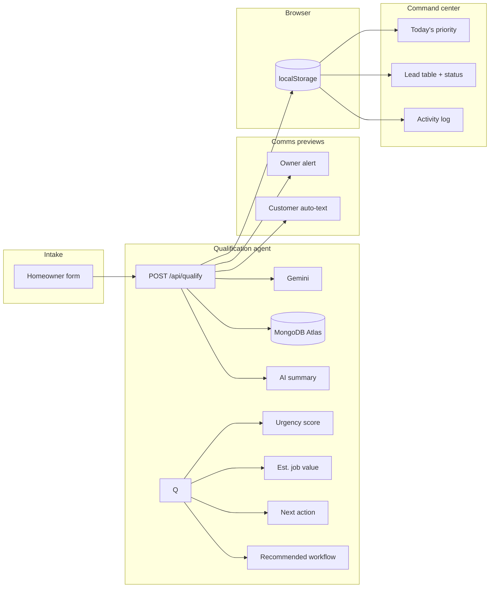

# LocalLead Agent

**AI-powered operational assistant for home-service businesses** that qualifies inbound leads, prioritizes urgency, recommends next actions, and organizes follow-up workflows—so crews respond before competitors.

Built with **Next.js**, **TypeScript**, and **Tailwind CSS**.

| | |
|---|---|
| **GitHub** | [github.com/bluxio/locallead-agent](https://github.com/bluxio/locallead-agent) |
| **Live demo** | _Add your Vercel URL after deploy_ |

---

## For technical reviewers

This MVP includes a **real full-stack qualification workflow**:

- Next.js App Router + TypeScript frontend
- Server-side **`POST /api/qualify`** route
- **Gemini 2.0 Flash** lead qualification (structured JSON)
- **MongoDB Atlas** persistence (`leads`, `lead_events`)
- **`GET /api/leads`** — dashboard hydrates from Atlas when configured
- **`PATCH /api/leads/[id]/status`** — status updates + event log
- Operational CRM-style command center (human oversight)
- **Mock fallback** if AI/API/DB is unavailable

Current architecture intentionally prioritizes fast iteration and demo clarity over production infrastructure (no auth, queues, or k8s).

### Core flow

```text
Homeowner intake
  → server-side qualification agent (Gemini)
  → structured summary + workflow
  → MongoDB persistence + lead_events
  → command center (load + status updates from Atlas)
```

### Key files

| File | Role |
|------|------|
| `src/app/api/qualify/route.ts` | Qualify + persist new leads |
| `src/app/api/leads/route.ts` | Dashboard data from MongoDB |
| `src/app/api/leads/[id]/status/route.ts` | Status change + event |
| `src/lib/gemini-qualify.ts` | Gemini API + JSON parse |
| `src/lib/mongodb.ts` | Atlas connection |
| `src/lib/lead-repository.ts` | Lead CRUD |
| `src/lib/lead-events.ts` | Event log helpers |
| `src/app/dashboard/dashboard-client.tsx` | Command center UI |

---

## One-line pitch (resume / LinkedIn / hackathon)

> LocalLead Agent is an AI-powered operational assistant for home-service businesses that automatically qualifies inbound leads, prioritizes urgency, recommends next actions, and organizes follow-up workflows to reduce lost revenue from delayed response times.

---

## What it is (positioning)

This is **not** “another CRM dashboard.” It is a **lead-response and coordination agent** for local trades:

1. **Intake** — homeowner request lands with trade, location, urgency, and contact preference.  
2. **Qualification agent** — analyzes the job and outputs summary, heat score (1–10), estimated value, **next action**, and a **multi-step recommended workflow**.  
3. **Command center** — today’s priority, metrics, rush queues, call/text actions, and status through booked/lost.

Intake submits to **`POST /api/qualify`**, which calls **Gemini** and persists to **MongoDB Atlas** when configured. The UI falls back to `mockQualifyLead` if the API, Gemini, or MongoDB is unavailable.

---

## Hackathon agent layer

| Piece | Role |
|-------|------|
| **Gemini** (`GEMINI_API_KEY`) | Reasons over intake → summary, urgency, value, next action, workflow, owner note |
| **MongoDB Atlas** (`MONGODB_URI`) | `locallead.leads` + `locallead.lead_events` on each qualification |
| **`POST /api/qualify`** | Thin server bridge — no UI rebuild |
| **This UI** | Human oversight command center (call, text, status) |
| **MongoDB MCP + Agent Builder** | Hackathon track orchestration layer (see `docs/HACKATHON_AGENT.md`) |

### Environment

Copy `.env.example` → `.env.local`:

```bash
GEMINI_API_KEY=your_gemini_key
MONGODB_URI=mongodb+srv://...
```

Vercel: add the same variables in **Project → Settings → Environment Variables**, then redeploy.

### Test the agent path

1. `npm install` && `npm run dev`  
2. Submit an urgent HVAC job on `/demo`  
3. Confirm owner packet + workflow (Gemini copy if key is set)  
4. In Atlas: `locallead.leads` and `locallead.lead_events`  
5. Dashboard loads from **MongoDB** when `MONGODB_URI` is set (falls back to browser storage + sample seeds)

---

## Features

- Marketing landing page with product-style hero and before/after narrative  
- Homeowner intake with **live owner preview** (desktop two-column)  
- **Lead packet** on submit: owner alert, customer auto-text draft, recommended action, **recommended workflow**  
- **Command center**: today’s priority, KPI strip, volume chart, pipeline + activity, rush/new queues, searchable lead table  
- **Follow-up actions**: call, text (draft body), booking link copy, mark contacted/booked  
- **Sample North Texas jobs** when the board is empty; new submissions appear at the top  

---

## Architecture



| Layer | Path | Role |
|--------|------|------|
| Pages | `src/app/` | `/`, `/demo`, `/dashboard` |
| Agent | `src/lib/mock-qualify.ts` | Qualification + workflow generation |
| Comms | `src/lib/lead-comms.ts` | Owner alert + customer text copy |
| Storage | `src/lib/leads-storage.ts` | Leads + activity in `localStorage` |
| Seeds | `src/lib/seed-leads.ts` | Sample DFW-area jobs |

---

## Google Cloud Rapid Agent Hackathon (MongoDB track)

**Devpost:** [rapid-agent.devpost.com](https://rapid-agent.devpost.com/) · Deadline **Jun 11, 2026**

| Doc | Purpose |
|-----|---------|
| [`DEVPOST.md`](./DEVPOST.md) | Copy/paste submission text, video script, checklist |
| [`docs/HACKATHON_AGENT.md`](./docs/HACKATHON_AGENT.md) | Gemini + Agent Builder + **MongoDB MCP** compliance path |

**Important:** The live UI is your **oversight layer**. Judges require **Gemini**, **Agent Builder**, and **MongoDB MCP**—see `docs/HACKATHON_AGENT.md` before submitting.

**License:** MIT — set **About → License** on GitHub to match `LICENSE`.

---

## Demo script (~3 minutes)

1. **Landing** (`/`) — problem + **Log a job request**.  
2. **Intake** (`/demo`) — urgent HVAC, Plano TX; show preview updating; **Generate lead packet**.  
3. **Packet** — owner alert, auto-text, **recommended workflow** (same-day diagnostic, rush escalation, etc.).  
4. **Command center** (`/dashboard`) — today’s priority, workflow on rush card, **Text customer**, **Mark booked**.  
5. **Refresh** — status persists.  
6. **Close** — “Production: OpenAI + MongoDB + Twilio on this same flow.”

---

## Screenshots (add before sharing)

Create `docs/screenshots/` and drop PNGs; link them here:

| Screen | File |
|--------|------|
| Landing hero | `docs/screenshots/home-hero.png` |
| Intake + preview | `docs/screenshots/demo-intake.png` |
| Lead packet + workflow | `docs/screenshots/demo-packet.png` |
| Today's priority | `docs/screenshots/dashboard-priority.png` |
| Command center | `docs/screenshots/dashboard-full.png` |

---

## Getting started

```bash
git clone https://github.com/bluxio/locallead-agent.git
cd locallead-agent
npm install
npm run dev
```

Open [http://localhost:3000](http://localhost:3000).

## Deploy (Vercel) — do this first

1. [vercel.com/new](https://vercel.com/new) → Import **`bluxio/locallead-agent`**.  
2. Framework: **Next.js** (root = repo root). Deploy.  
3. Paste production URL in this README + resume + LinkedIn.  

## Sample data

Six DFW-area sample jobs load when the board is empty. **Your intake submissions prepend** to the same list.

Reset: clear site data for the app origin, reload.

## Scripts

```bash
npm run lint
npm run build
npm run start
```

## Roadmap

| Phase | Work |
|-------|------|
| Now | Deploy, screenshots, 2–3 min demo video, LinkedIn post |
| Next | OpenAI route returning current `QualifyResult` shape |
| Then | MongoDB Atlas for leads + events |
| Then | Twilio owner SMS + customer texts |

## Out of scope (MVP)

Auth · payments · real Twilio · real OpenAI API · multi-tenant backend

---

## 7-day distribution checklist

| Day | Task |
|-----|------|
| 1 | Vercel live URL + README link + 5 screenshots |
| 2 | Record demo video (< 3 min), upload (YouTube unlisted / Loom) |
| 3 | LinkedIn post + pin GitHub repo on profile |
| 4 | Hackathon submission draft (MongoDB track narrative) |
| 5 | Send link to 3 people for feedback (recruiter, peer, local business contact) |
| 6 | Resume bullet + portfolio site link |
| 7 | Optional: MongoDB Atlas spike (read/write one collection)—only if hackathon deadline requires it |
